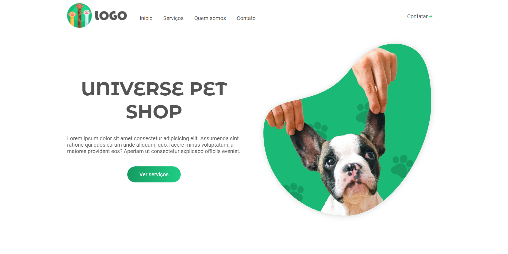

<h1 align="center">UNIVERSE PETSHOP</h1>
 

  <a href="#-tecnologias">Tecnologias</a>&nbsp;&nbsp;&nbsp;|&nbsp;&nbsp;&nbsp;
  <a href="#-projeto">Projeto</a>&nbsp;&nbsp;&nbsp;|&nbsp;&nbsp;&nbsp;
  <a href="#-autor">Autor</a>&nbsp;&nbsp;&nbsp;

 

## ✨ Preview

## 🚀 Tecnologias

Esse projeto foi desenvolvido com as seguintes tecnologias:

- HTML
- CSS
- JavaScript

### 📚 Biblioteca

- Scroll Reveal

## 💻 Projeto

Esse projeto foi desenvolvido na semana do programador da [Code Universe](https://www.codeuniverse.com.br), na premissa de aprimorar minhas habilidades em construções de sites responsivos.

## 👨‍💻 Autor

- Github: <a href="https://github.com/">MrEzequiel
  </a>
- Instagram: <a href="https://www.instagram.com/ezequield3v/">@ezequield3v</a>

<h3 align="center">Feito com ♥ by Ezequiel ⭐️</h3>
